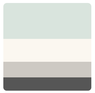

# iOS & Swift - The Complete iOS App Development Bootcamp
* [iOS & Swift - The Complete iOS App Development Bootcamp | Udemy](https://www.udemy.com/course/ios-13-app-development-bootcamp/)
* [Dr. Angela Yu | Developer and Lead Instructor| Udemy](https://www.udemy.com/user/4b4368a3-b5c8-4529-aa65-2056ec31f37e/)
* **Important links for the course:** [iOS Course Resources | The App Brewery](https://www.appbrewery.co/p/ios-course-resources)

## Section 3: Xcode Storyboard and Interface Builder Challenge

Now that you have been rich, it’s time to join the 99%. This app will proudly display a lump of coal and the statement “I Am Poor”; the perfect app for when you get asked for money on the streets.

The end result will look something like this. Although there’s endless scope for customisation. So hopefully, your app will look even better!

### About the color palette:

[Pastel Color Palettes - Color Hunt](https://colorhunt.co/palettes/pastel)
* #D9E4DD
* #FBF7F0
* #CDC9C3
* #555555

### About iPhone Resolutions:
* [The Ultimate Guide To iPhone Resolutions](https://www.paintcodeapp.com/news/ultimate-guide-to-iphone-resolutions)
* [App Icon Generator](https://appicon.co/)

### Show off the work 🥳 🥳 🥳 🥳

